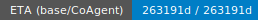

## 📊 Ops Dashboard (auto-refreshed)



<br/>


**Backlog snapshot**
| Stream | Open | 7-day Throughput | ETA (base) | ETA (with CoAgent) |
|---|---:|---:|---:|---:|
| Ingest (CoCache map) | `<calc>` | `<calc>/day` | `<calc>` | `<calc>` |
| Repo Sanitation | `<calc>` | `<calc>/day` | `<calc>` | `<calc>` |
| Hitchhiker Docs | `<calc>` | `<calc>/day` | `<calc>` | `<calc>` |

**Backlog types** → canonical definitions in **GIBindex**:
- [Ingest Backlog](https://github.com/<you>/GIBindex/blob/main/docs/backlog/ingest.md)
- [Sanitation Backlog](https://github.com/<you>/GIBindex/blob/main/docs/backlog/sanitation.md)
- [Docs/Runbook Backlog](https://github.com/<you>/GIBindex/blob/main/docs/backlog/docs.md)
- [Product (CoAgent) Backlog](https://github.com/<you>/GIBindex/blob/main/docs/backlog/product.md)

<!-- auto: begin ingest row -->
| Ingest (CoCache map) | 263191 | 0/day | 263191d | 263191d |

<!-- auto: end ingest row -->


<!-- daily-notices:start -->
## 🗓️ Today

<!-- includes generated below; edit files in STATUS/notices/ -->

<!-- pinned -->
<!--#include STATUS/notices/pinned.md-->

<!-- today -->
<!--#include STATUS/notices/2025-10-10.md-->
<!-- daily-notices:end -->

<!-- ops-dashboard:start -->

## 🔄 Refresh dashboard now

- **Web:** open the CoCache workflow and click **Run workflow**
  https://github.com/rickballard/CoCache/actions/workflows/ops-heartbeat-smoke.yml

- **CLI:**
```powershell
gh workflow run ops-heartbeat-smoke.yml -R rickballard/CoCache
# (once the main workflow registers)
# gh workflow run ops-heartbeat.yml -R rickballard/CoCache
```

